# offline_warehouse：电商离线数仓与经营分析

基于 **MySQL、Hive、Spark SQL 和 Airflow** 构建的电商离线数仓项目。项目从业务数据生成开始，完成 ODS、DIM、DWD、DWS、ADS 分层建设，最终形成经营总览、SKU 销售排行和店铺评分三类分析结果，并发布到 MySQL 供查询展示。

本仓库重点展示完整的数据工程链路、分层建模、指标口径、调度编排、数据质量与幂等重跑能力，适合作为大数据开发项目学习和面试交流材料。

关联实时风控仓库：[realtime_risk](https://github.com/jwdghmld/realtime_risk)

## 项目目标

- 将 MySQL 中的订单、支付、行为和评分数据稳定采集到 Hive。
- 建立清晰的 ODS、DIM、DWD、DWS、ADS 数仓分层。
- 统一订单金额、支付金额、商品、店铺和日期口径。
- 支持 `1d`、`7d`、`30d`、`all` 四种统计周期。
- 通过 Airflow 严格串联造数、采集、清洗、汇总、应用和发布阶段。
- 支持指定业务日期重跑，并通过分区覆盖和主键替换保证结果幂等。
- 在 MySQL 事务成功后发布交易事件，为独立实时风控链路提供输入。

## 最终结果

### 经营总览

经营总览聚合 PV、UV、收藏、加购、订单、支付用户、支付件数、GMV、客单价和浏览到支付转化率，用于观察站点整体经营表现。

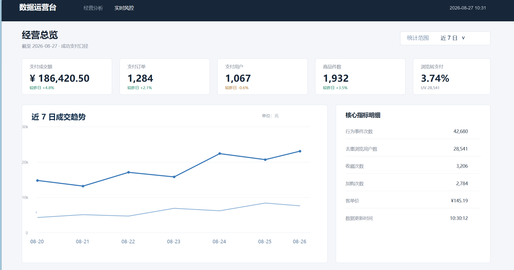

### SKU 销售排行

分别按照 GMV、支付件数和支付订单数生成 SKU Top 10，并保留商品、类目、店铺和统计周期信息。

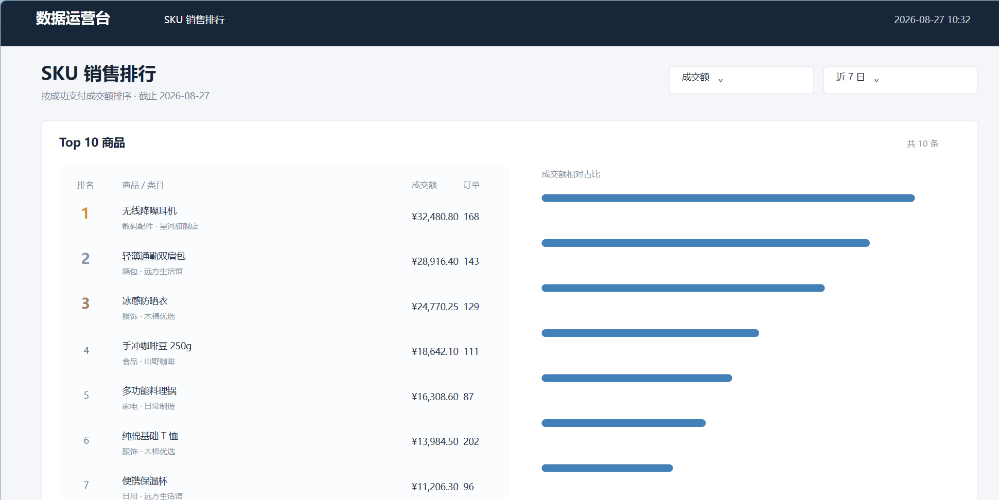

### 店铺评分

围绕评分数量、平均分、好中差评数量、好评率、差评率和 Wilson 好评率分析店铺质量，并输出风险标记。

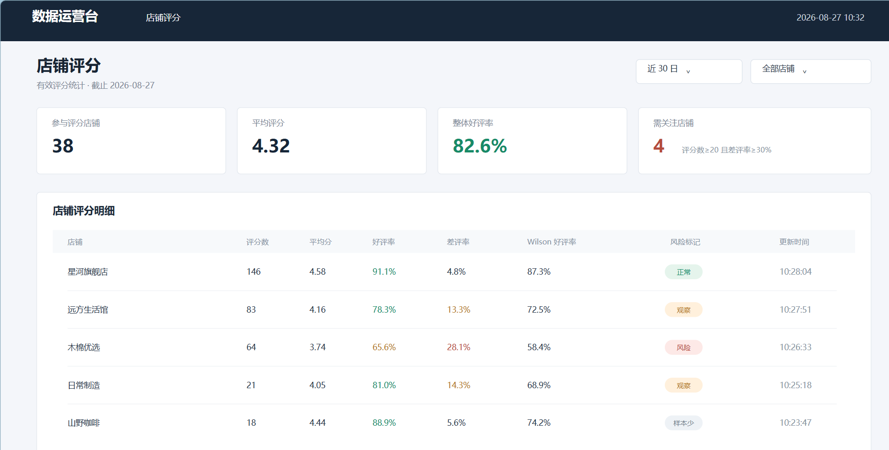

截图中的结果页用于验证数据产出。界面由 AI 辅助构建，数据查询层使用 Python 连接 MySQL `offline` 结果库并展示，本仓库交付重点为离线数据链路和结果表。

## 总体架构

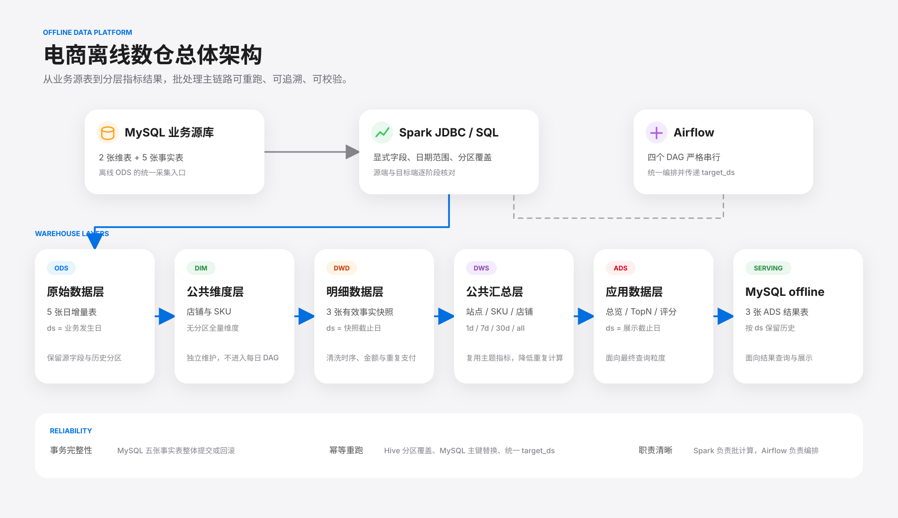

总体链路分为两条相互隔离的路径：

1. 离线主链路：Python 造数器 → MySQL 业务库 → Spark JDBC → Hive 分层 → MySQL `offline`。
2. 实时事件支路：MySQL 事务提交成功后 → Kafka 交易 Topic → `realtime_risk` 仓库。

离线链路只从 MySQL 采集业务数据，不从 Kafka 或 Flink 状态反向构建离线结果；实时链路也不参与 Hive 数仓计算。两套系统只共享业务字段、事件 ID 和 Kafka 消息合同。

## 技术栈

| 分类 | 技术与版本 | 用途 |
|---|---|---|
| 数据生成 | Python 3.9+ | 生成冻结维度、每日事实和 Kafka 交易事件 |
| 业务数据源 | MySQL 8.x | 保存店铺、SKU、订单、支付、行为和评分 |
| 离线存储 | Hive、HDFS、ORC | 保存分区历史数据和数仓快照 |
| 离线计算 | Spark 3.5.8、PySpark、Spark SQL | JDBC 采集、明细清洗、主题汇总和 ADS 计算 |
| 资源调度 | YARN | 运行 Spark Application |
| 任务调度 | Airflow 2.10.5 | 编排四个每日 DAG |
| 消息系统 | Kafka | 向实时风控发布订单、明细和支付事件 |
| 结果服务 | MySQL `offline` | 保存三类可直接查询的 ADS 结果 |
| 时间标准 | Asia/Shanghai | 统一业务时间、Spark SQL、JDBC 和分区日期 |

## 数据源设计

MySQL `ecommerce_business` 共有 2 张冻结维表和 5 张每日事实表。

| 类型 | 表名 | 业务粒度 | 作用 |
|---|---|---|---|
| 维度 | `shop_info` | 一行一个店铺 | 保存店铺名称、省份、开店时间和状态 |
| 维度 | `sku_info` | 一行一个 SKU | 保存商品、类目、店铺归属、价格和状态 |
| 事实 | `order_info` | 一行一个单店铺订单 | 保存订单用户、店铺、状态、金额和创建时间 |
| 事实 | `order_detail` | 一行一个订单商品明细 | 保存 SKU、数量、原始金额和成交金额 |
| 事实 | `payment_info` | 一行一次支付尝试 | 支持多次失败支付和最多一次成功支付 |
| 事实 | `user_behavior` | 一行一次用户行为 | 保存浏览、收藏和加购行为，仅用于离线分析 |
| 事实 | `rating_info` | 一行一个订单评分 | 保存店铺评分及评分时间，仅用于离线分析 |

每日事实脚本按固定顺序在单个 InnoDB 事务中删除并重建五张事实表。事务成功则完整提交，任一步骤失败则整体回滚，避免 Spark 采集到半批数据。

## 数仓分层架构

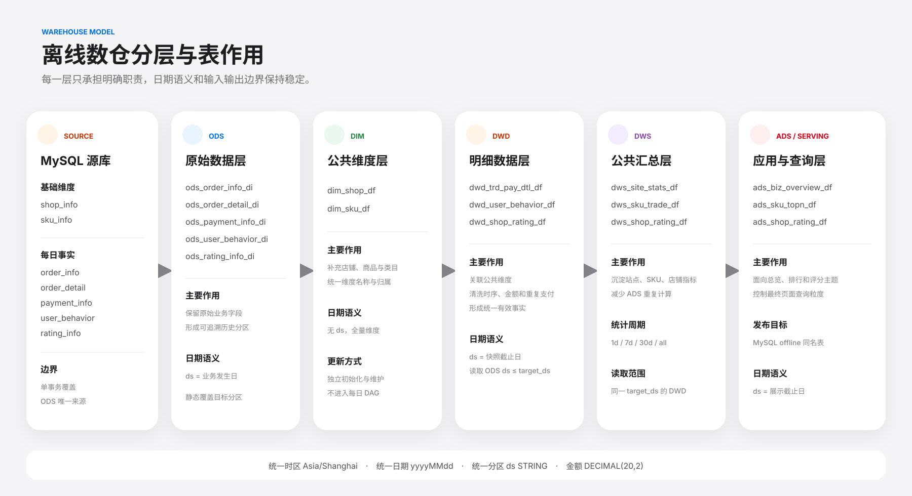

### ODS：原始数据层

| Hive 表 | 来源 | 作用 |
|---|---|---|
| `ods.ods_order_info_di` | `order_info` | 保存订单原始增量 |
| `ods.ods_order_detail_di` | `order_detail` | 保存订单商品明细原始增量 |
| `ods.ods_payment_info_di` | `payment_info` | 保存每次支付尝试原始增量 |
| `ods.ods_user_behavior_di` | `user_behavior` | 保存用户行为原始增量 |
| `ods.ods_rating_info_di` | `rating_info` | 保存店铺评分原始增量 |

ODS 使用 `ds` 表示业务发生日。Spark JDBC 根据各表业务时间字段使用左闭右开日期范围读取 MySQL，并通过静态 `insert overwrite` 只覆盖目标日期分区。

### DIM：公共维度层

| Hive 表 | 作用 |
|---|---|
| `cdm.dim_shop_df` | 冻结店铺维度，补充店铺名称和省份 |
| `cdm.dim_sku_df` | 冻结 SKU 维度，补充商品、类目和店铺归属 |

DIM 是无分区全量表。维度造数完成后人工执行一次 `dim_init_job.py`，初始化后不进入每日 Airflow DAG。

### DWD：明细数据层

| Hive 表 | 作用 |
|---|---|
| `cdm.dwd_trd_pay_dtl_df` | 统一订单、明细、成功支付和商品维度，形成有效交易明细 |
| `cdm.dwd_user_behavior_df` | 关联 SKU、类目和店铺信息的用户行为明细 |
| `cdm.dwd_shop_rating_df` | 关联有效交易与店铺维度的评分明细 |

DWD 的 `ds` 表示快照截止日。作业读取 `ods.ds <= target_ds` 的历史事实，对支付时序、重复成功支付、明细金额和支付金额进行清洗，并保存截至目标日的完整有效快照。

### DWS：公共汇总层

| Hive 表 | 汇总主题 | 主要指标 |
|---|---|---|
| `cdm.dws_site_stats_df` | 站点经营 | PV、UV、订单、支付用户、GMV、客单价、转化率 |
| `cdm.dws_sku_trade_df` | SKU 交易 | 支付订单、支付用户、支付件数、GMV |
| `cdm.dws_shop_rating_df` | 店铺评分 | 评分数、平均分、好中差评、好评率和差评率 |

DWS 只读取同一 `target_ds` 的 DWD 快照，统一计算 `1d`、`7d`、`30d` 和 `all` 四种统计周期，为 ADS 提供可复用的主题指标。

### ADS：应用数据层

| Hive / MySQL 表 | 页面主题 | 结果粒度 |
|---|---|---|
| `ads.ads_biz_overview_df` | 经营总览 | `ds + stat_period` |
| `ads.ads_sku_topn_df` | SKU 销售排行 | `ds + stat_period + rank_type + rank_no` |
| `ads.ads_shop_rating_df` | 店铺评分 | `ds + stat_period + shop_id` |

ADS 的 `ds` 表示展示截止日。三张 Hive ADS 表计算完成后，通过三个独立 Spark JDBC 发布作业写入 MySQL `offline` 同名结果表，并在发布前后校验行数、主键和关键字段。

## 完整数据链路

### 冻结维度初始化

```text
1_generate_dimensions.py
  -> MySQL shop_info / sku_info
  -> dim_init_job.py
  -> cdm.dim_shop_df / cdm.dim_sku_df
```

店铺和 SKU 是后续每日事实使用的冻结实体池。每日造数只从该实体池抽样，不新增店铺和 SKU。

### 每日事实与 Kafka 发布

```text
2_generate_daily_facts.py --ds target_ds --publish
  -> MySQL 五张事实表单事务覆盖
  -> COMMIT 成功
  -> Kafka 订单 / 明细 / 支付事件
```

Kafka 发布不是 MySQL 与 Kafka 的分布式事务。MySQL 已提交但 Kafka 失败时，使用相同日期和确定性种子重跑，重新发送相同 `event_id` 集合，由实时侧状态去重和稳定告警主键共同收敛。

### ODS 到 ADS

```text
MySQL -> ODS 日增量
      -> DWD 截止日明细快照
      -> DWS 多周期公共汇总
      -> ADS 页面主题结果
      -> MySQL offline
```

## Airflow 调度

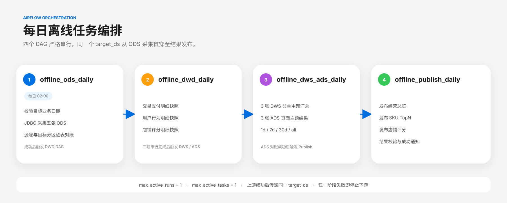

| DAG | 调度方式 | 主要任务 |
|---|---|---|
| `offline_ods_daily` | 每天 02:00 | 生成事实、发布 Kafka、采集五张 ODS |
| `offline_dwd_daily` | ODS 成功后触发 | 串行构建三张 DWD |
| `offline_dws_ads_daily` | DWD 成功后触发 | 串行构建三张 DWS 和三张 ADS |
| `offline_publish_daily` | ADS 成功后触发 | 发布三张 MySQL 结果表并通知 |

四个 DAG 均设置 `max_active_runs=1` 和 `max_active_tasks=1`。上游通过 `TriggerDagRunOperator` 将同一个 `target_ds` 传给下游，避免跨阶段日期不一致。

### Airflow 实际运行记录

下图展示 Airflow 中启用的四个离线 DAG 及最近成功运行状态。

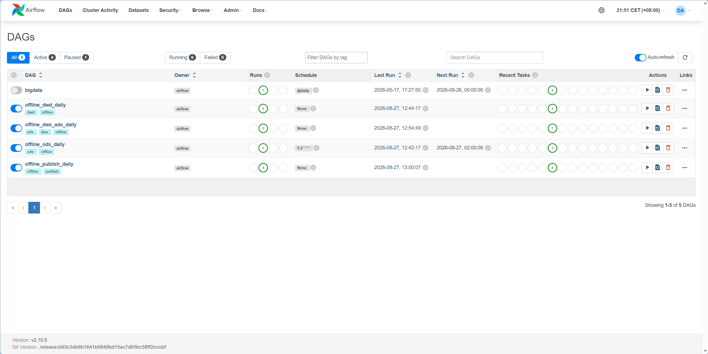

<details>
<summary>展开查看四个 DAG 的任务依赖截图</summary>

#### ODS DAG

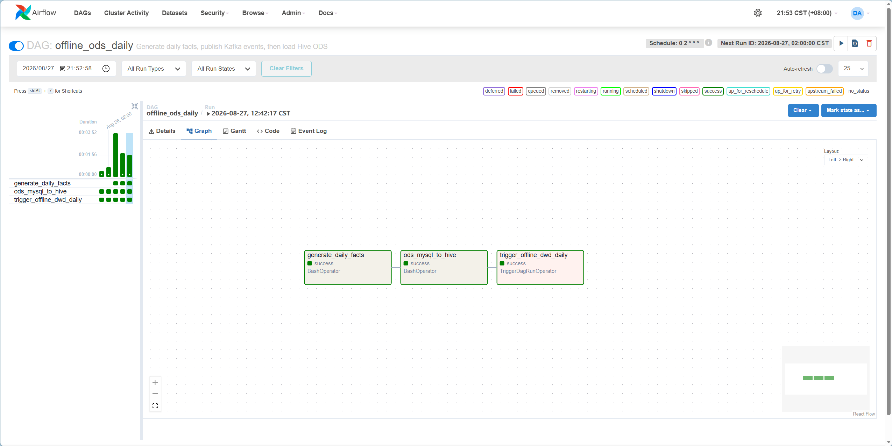

#### DWD DAG

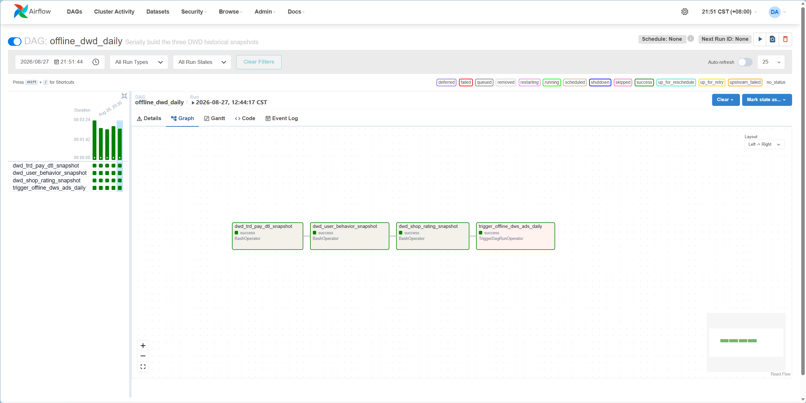

#### DWS / ADS DAG

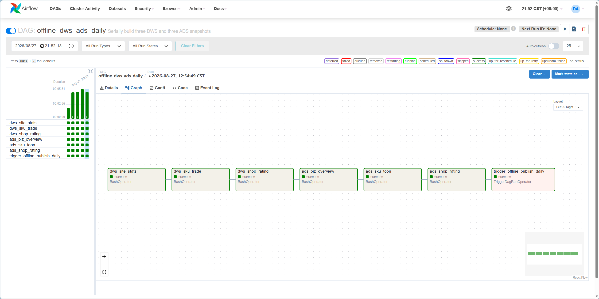

#### Publish DAG

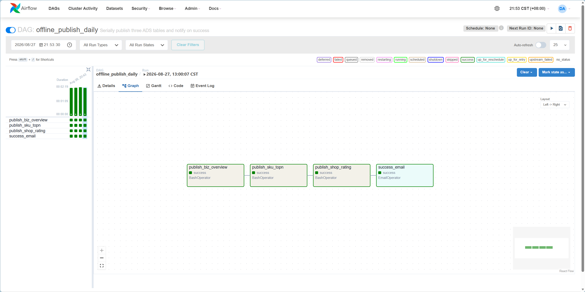

</details>

## 日期和快照语义

| 数据层 | `ds` 含义 |
|---|---|
| ODS | 业务发生日 |
| DIM | 无分区，冻结全量 |
| DWD | 历史有效事实快照截止日 |
| DWS | 公共指标统计截止日 |
| ADS | 页面展示截止日 |

统一时区为 `Asia/Shanghai`，日期格式为 `yyyyMMdd`，Hive 分区字段统一为 `ds STRING`。金额字段使用 `DECIMAL(20,2)`，比例字段使用 `DECIMAL(10,6)`。

## 核心指标口径

| 指标 | 口径 |
|---|---|
| PV | 统计周期内全部用户行为次数 |
| UV | 统计周期内发生行为的去重用户数 |
| 支付订单数 | 存在有效成功支付的去重订单数 |
| 支付用户数 | 存在有效成功支付的去重用户数 |
| 支付件数 | 有效交易明细中的 SKU 数量合计 |
| GMV | 有效支付交易明细成交金额合计 |
| 客单价 | GMV / 支付订单数 |
| 浏览到支付转化率 | 支付用户数 / 浏览用户数 |
| SKU TopN | 按 GMV、支付件数、支付订单数分别排名 |
| Wilson 好评率 | 在评分样本量差异下更稳健地衡量好评表现 |

## 数据质量与幂等设计

- 确定性造数：相同 `ds + base_seed + 冻结维度` 生成相同业务数据和 Kafka 事件。
- 事务完整性：五张事实表在单个 MySQL 事务中整体提交或整体回滚。
- ODS 对账：逐表核对 MySQL 源端行数和 Hive 目标分区行数。
- 交易质量：剔除支付早于下单、重复成功支付、明细金额不一致和支付金额不一致的交易。
- 分区幂等：Hive 使用静态 `insert overwrite` 覆盖目标 `ds`。
- 发布幂等：MySQL 结果表按业务主键替换目标日期数据。
- 小文件控制：写 Hive 前按 `SPARK_OUTPUT_PARTITIONS` 合并最终输出分区。
- 资源稳定：关闭动态资源，启用 AQE、倾斜 Join 和广播优化。

## 资源规划

```text
Spark 3.5.8 on YARN
num-executors = 2
executor-cores = 3
spark.default.parallelism = 12
spark.sql.shuffle.partitions = 12（可配置）
最终输出分区 = 3（可配置）
```

该配置用于项目数据规模下的稳定串行执行。生产环境可通过环境变量调整 Shuffle 和输出分区，不在作业源码中保存集群地址或账号。

## 仓库目录

```text
offline_warehouse/
├── .github/
│   └── workflows/ci.yml                 # Python、单元测试和 Shell 校验
├── airflow/
│   ├── dags/                            # 四个离线 DAG
│   └── requirements-py311.txt
├── contracts/
│   ├── kafka/topic-contract.md          # Kafka 交易事件合同
│   └── mysql/
│       ├── 01_business.sql              # 业务源表
│       └── 02_offline.sql               # 离线结果表
├── docs/
│   ├── design.md                        # 详细设计与指标说明
│   ├── deployment.md                    # 配置和部署说明
│   └── images/                          # SVG 架构图与运行截图
├── hive/ddl/                            # ODS、DIM、DWD、DWS、ADS DDL
├── source-data-generator/
│   ├── config/                          # 正式与小型验证配置
│   ├── tests/                           # 造数器合同测试
│   ├── 1_generate_dimensions.py
│   └── 2_generate_daily_facts.py
├── spark/
│   ├── dim/
│   ├── ods/
│   ├── dwd/
│   ├── dws/
│   ├── ads/
│   ├── mysql-spark.sh
│   └── spark-env.sh
├── .gitignore
└── README.md
```

## 仓库关系与项目边界

- 当前仓库负责业务数据生成、离线数仓和 ADS 结果发布。
- 实时风险检测代码位于 [realtime_risk](https://github.com/jwdghmld/realtime_risk)。
- 两个仓库共享 `contracts/kafka/topic-contract.md`，当前合同版本为 `1.0.0`。
- 当前项目不使用 CDC；Kafka 事件由每日事实脚本在 MySQL 提交成功后主动发布。
- 配置文件中的“此处自定义”必须由部署者按实际环境填写。

## 延伸文档

- [离线数仓详细设计](docs/design.md)
- [离线部署与环境配置](docs/deployment.md)
- [Kafka 交易事件合同](contracts/kafka/topic-contract.md)
- [实时风控仓库](https://github.com/jwdghmld/realtime_risk)
